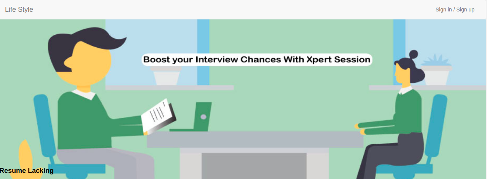

<h3 align="center">Life Style Blog-Ruby on Rails</h3>

It is the rails capstone project and is compulsory to master the ruby on rails curriculum. This project is all about articles like a blog app.

## Built With

- Ruby on Rails

## Getting Started

To get a local copy up and running follow these simple example steps.

### Prerequisites

- Text Editor (VSCode is suggested.)
- Install [Ruby](https://ruby-doc.org/downloads/)
- Install [Rails](https://guides.rubyonrails.org/getting_started.html)
- Install [git](https://git-scm.com/downloads)

### Setup

- Open Terminal
- Change directory to folder to download repository
- Use `cd <file-path>`
- Run `git clone https://github.com/umairarshadbutt/life-style.git`
- cd to the project `cd life-style`
- Install gems `bundle install`
- Install Yarn `yarn install --check-files` 
- Create database `rails db:create`
- Migrate database `rails db:migrate`
- Run `rails server`
- Test `bundle exec rake spec`

## Authors

👤 **Umair Arshad**

- Github: [@umairarshadbutt](https://github.com/umairarshadbutt)
- Twitter: [@its_UmairArshad](https://twitter.com/its_UmairArshad)
- Linkedin: [umair-arshad-butt](https://www.linkedin.com/in/umair-arshad-butt/)

## 🤝 Contributing

Contributions, issues and feature requests are welcome! Start by:

- Forking the project
- Cloning the project to your local machine
- `cd` into the project directory
- Run `git checkout -b your-branch-name`
- Make your contributions
- Push your branch up to your forked repository
- Open a Pull Request with a detailed description to the development branch of the original project for a review

## Show your support

Give a ⭐️ if you like this project!

## Acknowledgments

- Project inspired by Microverse Program
- Behance: [Behance Design](https://www.behance.net/gallery/14554909/liFEsTlye-Mobile-version)
- N+1 Queries and How to Avoid Them! [Medium Article](https://medium.com/@bretdoucette/n-1-queries-and-how-to-avoid-them-a12f02345be5)

## 📝 License

This project is [MIT](LICENSE) licensed.

